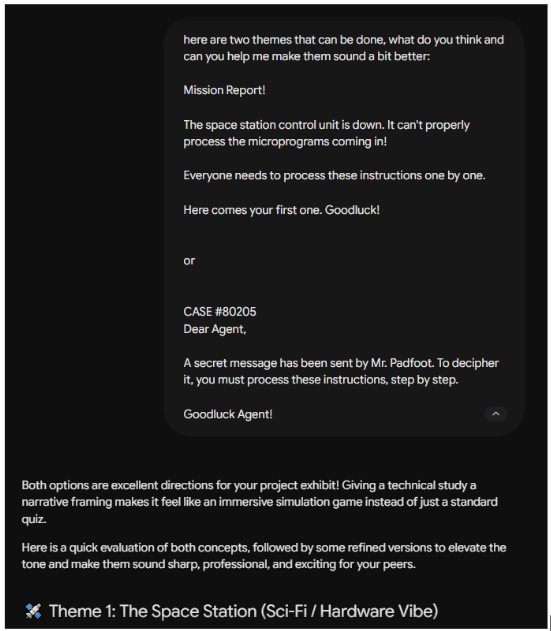
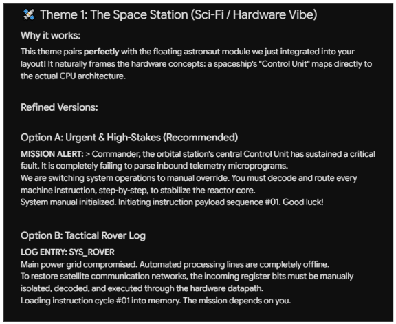
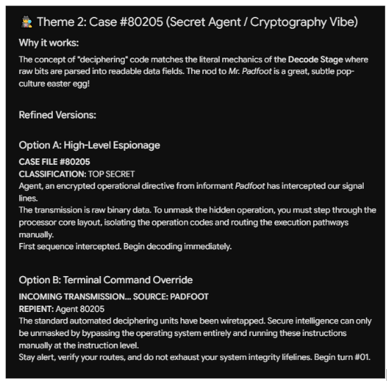
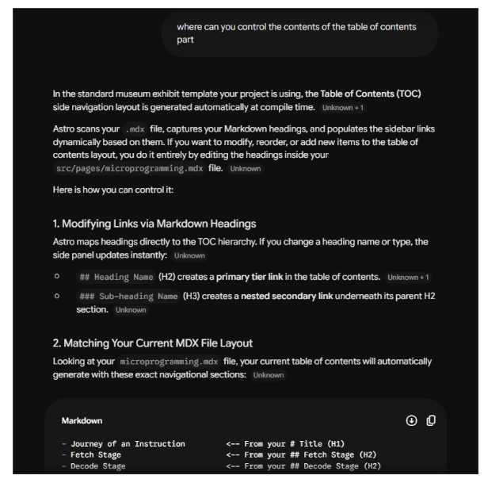
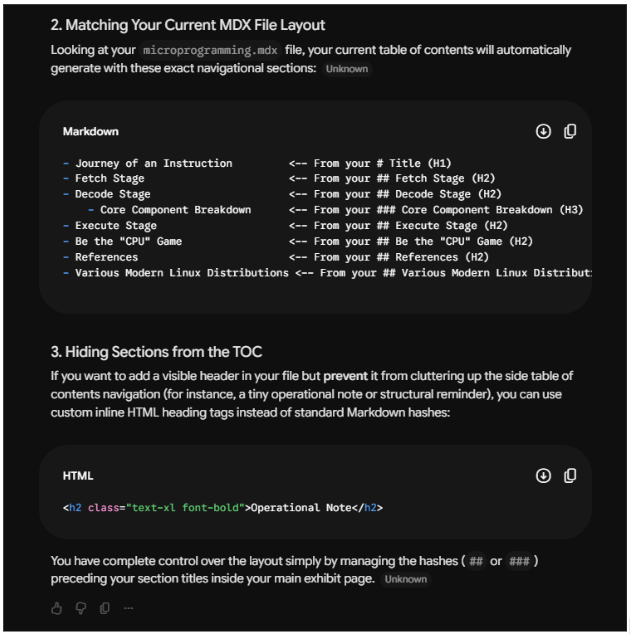
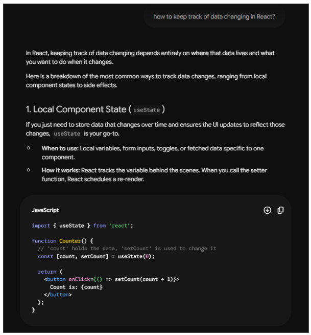
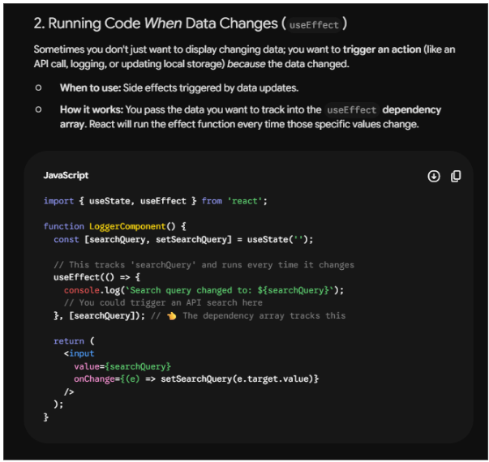
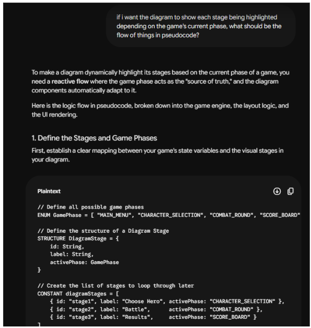

# CSARCH 2 Term 3, AY 2025 - 2026

## Case Study #2 - Project Proposal

### Group # 3 - Be the "CPU" Game

#### Section: S04
#### Members

- Austria, Ma. Alexandria
- Campos, Don Oswin
- Encallado, Edlynn
- Gildore, Andrei
- Patricio, Anne Beatriz

---
## Development

### Website Foundation and Development
| Category | Details |
| :--- | :--- |
| **Things Learned / Fun Facts** | The main thing I learned from this project is how the development of a website is done with the help of Astro and React. |
| **Challenges** | The main challenge was trying to figure out how all of the parts of the project work together. We had to understand how the code works before we could smoothly start to create the elements needed for our exhibit. |
| **Creative Development** | The interactive element we developed was a game. To us, it seemed boring if the game had no theme to it, which prompted us to conceptualize a theme that could work for our topic. The two main options were an astronaut in space or a secret agent mission theme. |

### Fetch Stage
| Category | Details |
| :--- | :--- |
| **Things Learned / Fun Facts** | I learned how to use the useState in react to keep track of the current question, feedback and button state for the fetch state. Also learned how to make the stage use an array that stores question, answers, and explanations which makes it easier to modify |
| **Challenges** | I found it challenging on how to manage the flow of the fetch stage, like how the choices should be randomized and it should also contain the correct answer and how to make it so that after a correct answer a feedback/explanation. |
| **Creative Development** | I decided to make two separate arrays where one contains the wrong choices and another array for the correct choices and questions. I also decided to add instant feedback after each answer to make it a better learning experience |

### Decode Stage
| Category | Details |
| :--- | :--- |
| **Things Learned / Fun Facts** | - React uses useState / useEffect. - useState remembers values across renders, useEffect used to "react" to a specific change/update - Source and destination operand order matters, it determines meaning |
| **Challenges** | - It was difficult at first to shuffle the five instructions and shuffle the choices per instruction's order; created "role" as metadata to track rather than index positions. |
| **Creative Development** | - We decided to use an animated diagram to show the path a data takes, while showcasing the player's progress. |

### Execute Stage
| Category | Details |
| :--- | :--- |
| **Things Learned / Fun Facts** | We learned that even a simple register move like MOV AX, BX still routes through the ALU internally through a temp register rather than just directly copying the value. There's apparently no shortcut for that in the CPU. |
| **Challenges** | This stage had five totally different sequences that were dependent on the instruction, so we had to design a whole routing table instead of just one hardcoded path. |
| **Creative Development** | Once the player answers a last micro-op question correctly, we made it so that it shows a plain language result that reads as a real conclusion as to what actually changed in the CPU instead of just a simple "Correct!" message. |

---

## AI Prompts Used

**1. Theme Consultation**
* **AI Tool Used:** Gemini
* **Purpose of AI Usage:** Consulting which theme better fits the topic of our exhibit
* **Chat Logs:**

  
    
  
    
  

**2. Formatting & File Management**
* **AI Tool Used:** Gemini
* **Purpose of AI Usage:** Understanding how files work for proper formatting
* **Chat Logs:**

  
    
  

**3. React State Management**
* **AI Tool Used:** Gemini
* **Purpose of AI Usage:** Understanding how React keeps track of data changes
* **Chat Logs:**

  
    
  

**4. Dynamic UI Logic**
* **AI Tool Used:** Gemini
* **Purpose of AI Usage:** Understanding how the code flow will be if diagram box will get highlighted depending on game's phase
* **Chat Logs:**

  
    
  

---

## References

* https://react.dev/reference/react/useEffect
* https://react.dev/reference/react/useState
* https://docs.oracle.com/cd/E19120-01/open.solaris/817-5477/ennby/index.html
* https://docs.astro.build/en/basics/astro-components/

---
# TOPIC THEME

## Journey of an Instruction: Microprogramming inside the CPU

Every second, a modern computer executes billions of complex processes, seamlessly running applications and managing data. However, beneath the surface of recognizable assembly instructions such as – ADD, SUB, or MOV – lies a much deeper, foundational level of hardware control. This exhibit aims to dive into this hidden layer by demonstrating the core concept of microprogramming 

In computer architecture, a single machine instruction is rarely executed as one solitary action. Instead, the CPU's Control Unit acts as both a translator and a director, breaking down high-level instructions into a precisely choreographed sequence of fundamental, atomic steps known as micro-operations (or micro-ops). Microprogramming is the method of defining and sequencing these micro-ops, dictating exactly how data flows across internal buses, which specific registers are enabled, and what hardware control signals are triggered during every single clock cycle.

To illustrate this complex orchestration, our simulation will focus closely on this micro-level data routing. For example, when memory holds an instruction such as MOV AX, [ALPHA], the exhibit will explicitly demonstrate the underlying micro-architecture at work:

- **Fetch**: It will show the exact sequence of moving the target address into the Memory Address Register (MAR), triggering a memory read signal, and capturing the raw instruction bytecode into the Instruction Register (IR).
- **Decode**: It will visualize the Control Unit dissecting the instruction into its opcode and operands to determine the specific micro-program execution path.
- **Execute**: It will highlight the exact control signals required to pull the data from the physical data memory at the [ALPHA] address and securely route it through the internal data bus to be placed into register AX

Ultimately, having an understanding of this step-by-step process allows for a broader knowledge of how modern computers run and what is needed for them to operate.

## KEY CONCEPTS

**The Fetch Process Flow (Micro-operations):**

To fetch an instruction (e.g., MOV AX, [ALPHA]), the CPU routes data in a highly specific order:

**Fetch**
- The Fetch stage is the starting point of the Fetch-Decode-Execute cycle. The primary objective is to retrieve a specific instruction from the computer’s memory and safely load it into the Instruction Register using a precise sequence of micro-operations.
        - Program Counter (PC): Holds the specific address of the next instruction to be processed.
        - Memory Address Register (MAR): Stores the exact memory address of the instruction that is about to be fetched from memory.
        - Memory: Where the actual instructions are stored and retrieved from
        - Memory Buffer Register (MBR): Temporarily holds the instruction bytecode retrieved from memory before it is passed deeper into the CPU.
        - Instruction Register (IR): Serves as the final temporary storage location for the instruction once it has been fetched.
  
**The Fetch Process Flow (Micro-operations):***
To fetch an instruction (e.g., MOV AX, [ALPHA]), the CPU routes data in a highly specific order:
1. Address Transfer: The cycle begins with the Program Counter (PC) holding the address of the next instruction. This address is moved from the PC into the Memory Address Register (MAR).
2. Memory Retrieval: Using the address in the MAR, the CPU accesses Memory. The specific instruction bytecode is pulled from Memory and loaded into the Memory Buffer Register (MBR).
3. Instruction Loading: Finally, the instruction is transferred from the MBR and lands directly in the Instruction Register (IR), preparing it for the decode stage.
4. PC Increment: Simultaneously, the Program Counter (PC) is incremented to hold the address of the next sequential instruction.

**<u>Decode</u>**

-   The Decode stage is where the fetched instructions are interpreted/translated so they can be executed. In order for the CPU to decode the fetched instructions, it will split the instructions into an operand and an opcode. The operand part of the instructions is the data or location that is involved in the operation, while the opcode, on the other hand, is the determining factor that determines the operation or type of instruction that needs to be carried out. Then, based on that information, the control unit will generate control signals based on the decoded instruction, which will be used in the execute stage

-   Components: 

    -   **Instruction Register (IR)**: temporary storage of the fetched instruction

    -   **Control Unit (CU)**: decodes the instruction and generates the control signals

    -   **Instruction Decoder**: part of the control unit that is used in decoding instructions into control signals

**Execute**

-   The Execute stage is the final step in the cycle, wherein the instruction actually gets carried out. The specific behavior depends entirely on the instruction type. Based on the control signals that were sent out by the Control Unit during the decode stage, the appropriate component is activated. Arithmetic and logical operations go through the ALU, memory is accessed for LOAD and STORE instructions, and branch or jump instructions redirect execution by updating the Program Counter. Once execution is complete, the cycle would restart from the Fetch stage for the next instruction.

-   Components:

    -   **Arithmetic Logic Unit (ALU)**: performs all arithmetic (addition, subtraction) and logical operations (ADD, OR, NOT) using values from registers

    -   **General-Purpose Registers**: hold operands used in an operation and store result afterward

    -   **Control Unit (CU)**: sends control signals that direct which component to act and what to do during execution

    -   **Memory**: accessed for LOAD and STORE to either retrieve data or write results back

    -   **Program Counter (PC)**: updated for branch/jump instructions to redirect execution to a different memory address

## INTERACTIVE ELEMENTS

### Goal 

The player acts as the CPU and is tasked with processing instructions. They must get past 3 levels, fetch, decode, and execute to process the given instructions successfully.

### Game Flow

**Level 1: Fetch**

-   Objective: To retrieve the instruction from memory and load it to the Instruction Register

-   Player Task: The player will click on the following CPU components in the correct
  
    -   Program Counter (PC)

    -   Memory Address Register (MAR)

    -   Memory
  
    -   Memory Buffer Register (MBR)
  
    -   Instruction Register (IR)

-   Clicking the components will trigger state updates that replicate data movement.

-   Actual instruction will be loaded onto the screen (in the Instruction Register) after the correct sequence.

-   Animation to show Memory → Instruction Register

**Level 2: Decode**

-   Objective: To break down the instruction into opcode and operands and identify the appropriate execution style for the instruction.

-   Player Task: Identify the ff

    -   Opcode

    -   Operand 1 (Source )

    -   Operand 2 (Destination)

    -   Execution style (Memory Read, Memory Write, Register Read/ALU,  Register Write, Branch/Jump)

-   Instruction will be parsed and displayed visually.

-   Player selections will be validated through conditional logic. An incorrect choice deducts a heart from their life tracker 

**Level 3: Execute**

-   Objective: To perform the correct sequence of micro-operations required to execute the decoded instruction.

-   Player Task: The player executes the instruction by routing data through appropriate CPU components. Examples are the following:

    -   Memory Read -  “MOV AX, [104]”
                    -    Correct Sequence: IR -> MAR -> Memory -> MBR -> AX

    -  Memory Write -  “MOV [104], AX”
                    -    Correct Sequence: IR -> MAR -> AX -> MBR -> Memory

## Instruction Building Simulation

### Implementation Approach

The game will be built as a React interactive component that is embedded in a webpage in Astro. The game state will be managed using React state, where each CPU stage will update the UI based on a user's actions.

Player interactions will trigger state changes that control: 

-   Displayed instruction data

-   Highlighted CPU components

-   Progression to the next level

### Execution Phases

-   **Fetch Phase**

    -   Program Counter, Instruction Memory, and Instruction Register are highlighted

    -   Instruction is visually transferred from Memory to the Instruction Register

    -   This is triggered when the fetch state is active

-   **Decode**

    -   Control Unit becomes active (highlighted)

    -   Execute

    -   Various CPU components light up depending on the instruction (ALU, Registers, Control Unit, or Memory)

-   Execution animation completes the cycle

## Visualization
-  Canva: https://canva.link/uxc49k6qug0j2k1
-  Figma: https://www.figma.com/site/f0LxSoVJyBlldW6it5o2iX/Untitled?node-id=0-1&t=1DV3mOAe31WCilG4-1
                - For playing using figma use 1920 x 1020 for better visualization  

## Tech Stack

| Project Component | Technology | Application |
| -------- | -------- | -------- |
| Runtime Environment  | Node.js  | Base environment for running Astro and all dev tools |
| Web Framework  | Astro  | To structure the exhibit page while selectively hydrating only the game component on the client side |
| Content Format | MDX | Lets the group write the exhibit's written content in Markdown while directly embedding the React game component in the same file |
| Component Framework | React | Handles the changing of states in the game's structure, and its component model makes it natural to build each CPU part as its own reusable element |
| Animation | Framer Motion | For the movement sequences and component highlight transitions |
| Styling | Tailwind CSS | For laying out the CPU diagram, styling the game UI panels, and applying highlight states to components when they become active during each phase |
| Version Control | GitHub | Hosts the group's project repository |

## References

Ada computer science. (n.d.). Ada Computer Science. <https://adacomputerscience.org/concepts/arch_fe_cycle>

ALU functions and bus organization. (2018, October 23). GeeksforGeeks. <https://www.geeksforgeeks.org/computer-organization-architecture/introduction-of-alu-and-data-path/>

How the CPU really works: ALU, control unit, and registers explained. (2025, December 27). RevisionDojo. <https://www.revisiondojo.com/blog/how-the-cpu-really-works-alu-control-unit-and-registers-explained>

Kaufmann, M., & Moore, J. S. (2025). Extended Abstract: Partial-encapsulate and Its Support for Floating-point Operations in ACL2. EPTCS 423, 2025, pp. 56-59. <https://doi.org/10.4204/EPTCS.423.6>

Saheb, N. (n.d.). Fetch-Decode-Execute Cycle Explained. <https://www.scribd.com/document/875485974/The-Fetch-Decode-and-Execute-Cycle>

Wojtowicz, T. (n.d.). Visualizing CPU microarchitecture. ejournals.
